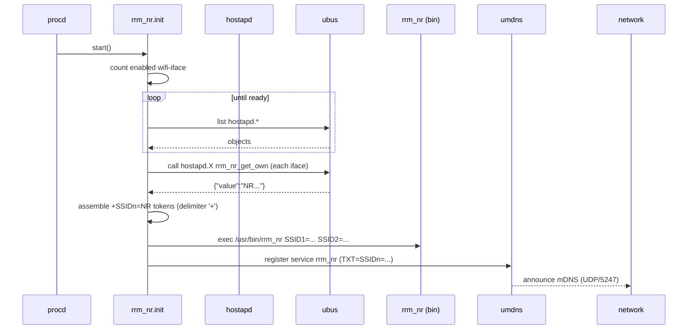

802.11k Neighbor Report (NR) Distributor
=======================================

Distributes per‑BSS 802.11k Neighbor Report data across a set of OpenWrt APs using mDNS so clients (and higher‑level steering logic) can discover other BSSes of the same ESS quickly. The provided init script collects each hostapd instance's own NR data and exposes it as TXT records of an mDNS service (`_rrm_nr._udp` / port 5247).

## Features ✨

- Multi‑radio / multi‑band support (sequential `SSIDn=` TXT records)
- Helps band / BSS steering by advertising sibling BSS information
- Works once `umdns` is functioning (no extra controller needed)
- Minimal logging (single tag `rrm_nr`) but enough to diagnose startup
- Deterministic neighbor list ordering (by SSID then BSSID) & duplicate suppression (remote duplicates collapsed)
- Per‑interface neighbor counts (post self‑filter) exposed as metrics
- Concise one‑line `summary` command (easy monitoring / telemetry)
- Metrics reset (`reset_metrics`) & on‑demand refresh (`refresh`)
- Baseline per‑SSID push guarantees initial hostapd population even with no diff
- Remote uniqueness tracking (cycle + cumulative) for observability of discovery breadth
 - Remote installer mode (stage & execute over SSH with a single command)

## Architecture

Component | Purpose
----------|--------
`service/rrm_nr.init` | procd init script: gathers NR data via `ubus`, formats TXT args, registers mDNS service
`bin/rrm_nr` | Opaque daemon consuming positional `SSIDn=<value>` args (prebuilt; no source here)
`lib/rrm_nr_common.sh` | Shared POSIX helpers (adaptive retry, iface mapping, millisecond sleep abstraction, probes)
`examples/wireless.config` | Example `/etc/config/wireless` enabling 802.11k (`ieee80211k '1'`, `bss_transition '1'`)

### Data Flow Summary
1. Count enabled `wifi-iface` stanzas (skip those with `option disabled '1'`).
2. Wait until that many `hostapd.*` objects appear on `ubus` (ensures hostapd ready).
3. For each `hostapd.*`: call `ubus call <obj> rrm_nr_get_own` → JSON `{"value":"..."}`.
4. Build concatenated string `+SSID<n>=<value>` (delimiter `+` chosen because invalid in SSIDs) then split into positional args.
5. Start daemon & register mDNS `rrm_nr` UDP/5247 with those TXT records.

### Startup Sequence (Mermaid)



## Installation

You have three progressively more automated options (plus a remote orchestration helper):

### 1. Quick Scripted Install (Local, Recommended)

On the target OpenWrt device (copy the repo over or clone with git if available):

```sh
# assuming repository now at /tmp/rrm_nr_src (e.g. scp -r ./ root@ap:/tmp/rrm_nr_src )
cd /tmp/rrm_nr_src
sh scripts/install.sh
```

Options:
- `--no-start` only stage files (don’t enable/start service)
- `--force-config` overwrite existing `/etc/config/rrm_nr`
- `--add-sysupgrade` append required paths to `/etc/sysupgrade.conf` for persistence
- `--prefix /overlay` stage into another root (image build workflows)
 - `--deps-auto-yes` / `--deps-auto-no` non‑interactive dependency handling
 - `--install-optional` install high‑resolution sleep helper (coreutils-sleep or coreutils)
 - `--fix-wireless` auto-enable missing 802.11k / BSS transition options

### Remote Install From Your Workstation

Run the installer locally and have it stage + execute itself on one or more remote OpenWrt hosts over SSH (no manual scp required). The script:
1. Builds a minimal file set + a `sha256` manifest.
2. Streams a tar archive over SSH to each host (parallel sequentially, one after another).
3. Verifies integrity via `sha256sum -c` on the target (warns & skips verification if `sha256sum` absent).
4. Executes the same `install.sh` remotely with preserved non-remote flags.
5. Optionally cleans up the staging directory.

Examples:

```sh
# Basic (defaults to root user if user@ not provided)
sh scripts/install.sh --remote ap1

# Multiple hosts (comma or repeat) + auto dependency install + optional extras
sh scripts/install.sh --remote ap1,ap2,ap3 --deps-auto-yes --install-optional
sh scripts/install.sh --remote ap1 --remote ap2 --remote ap3 --force-config

# Custom SSH port + force config + integrity check (automatic)
sh scripts/install.sh --remote ap1 --ssh-opts '-p 2222' --force-config

# Dry-run (prints plan, hashes, commands; makes no changes)
sh scripts/install.sh --remote ap1,ap2 --remote-dry-run

# Keep staging directory for inspection
sh scripts/install.sh --remote root@ap1 --remote-keep

# Alternate staging directory
sh scripts/install.sh --remote ap1 --remote-prefix /tmp/rrm_nr_stage_alt
```

Remote control flags (not forwarded to the target invocation):

Flag | Purpose | Default
-----|---------|--------
`--remote <host[,host2]>` | Enable remote mode for one or many hosts (comma or repeat) | (off)
`--remote-prefix <dir>` | Staging directory on target | `/tmp/rrm_nr_remote`
`--remote-keep` | Retain staging directory after success | (removed)
`--ssh-opts "..."` | Extra SSH options (port, identity, etc.) | (none)
`--remote-dry-run` | Show plan + hashes, exit without changes | (off)
`--remote-retries <n>` | Retry count per host (exponential backoff) | 1
`--remote-backoff <s>` | Base seconds for backoff (2,4,8...) | 2

All other standard flags (`--force-config`, `--no-start`, `--deps-auto-yes`, etc.) are preserved and applied on the remote side.

Notes:
- Requires `ssh` & `tar` locally and `tar` on the target (present on typical OpenWrt images).
- Integrity: Uses `sha256sum -c` on the target. If absent remotely, a warning is emitted and install proceeds (consider `opkg install coreutils-sha256sum`).
- Multi-host executes sequentially; failures on one host do not halt others (overall exit code reflects any failure).
- Retry logic: Each host retried up to `--remote-retries` times; delay sequence = base, base*2, base*4, ... using `--remote-backoff` as the starting seconds.
- Dry-run still generates a manifest locally then removes it (no remote connections made).
- Missing optional files are noted but not fatal.
- Failures leave the staging directory intact for that host (unless missing connectivity precluded creation).

### 2. Manual Copy (Minimalistic)

1. Ensure radios share a common ESSID where you want neighbor data propagated.
2. Enable 802.11k + BSS transition in each interface:
	- `option ieee80211k '1'`
	- `option bss_transition '1'`
3. Ensure `umdns` is installed & running (`opkg install umdns`).
4. Copy files:
	```sh
	cp service/rrm_nr.init /etc/init.d/rrm_nr
	cp bin/rrm_nr /usr/bin/rrm_nr
	cp lib/rrm_nr_common.sh /lib/rrm_nr_common.sh 2>/dev/null || true
	chmod +x /etc/init.d/rrm_nr /usr/bin/rrm_nr
	/etc/init.d/rrm_nr enable
	/etc/init.d/rrm_nr start
	```
5. Verify basic operation:
	```sh
	logread | grep rrm_nr
	ubus call umdns browse | grep SSID1=
	/etc/init.d/rrm_nr status
	```

### 3. Image / SDK Integration (Package Skeleton)

This repository now includes a ready package skeleton under `package/rrm-nr-distributor/`.

Quick build (inside an OpenWrt buildroot):
```sh
cp -r package/rrm-nr-distributor <openwrt-root>/package/
make menuconfig   # Network -> rrm-nr-distributor (select <M> or <*> )
make package/rrm-nr-distributor/compile V=sc
```

Resulting ipk (example): `bin/packages/<target>/base/rrm-nr-distributor_*.ipk`.

Install on device:
```sh
opkg install rrm-nr-distributor_*.ipk
```

Notes:
- Prebuilt daemon binary is shipped as-is (no compilation step). Replace with source + build logic later if available.
- Default config installed at `/etc/config/rrm_nr` (marked as conffile, preserved across upgrades).
- Helper library `lib/rrm_nr_common.sh` and init script installed automatically.

### Post-Install Checklist

- `logread | grep rrm_nr` shows a line "All wireless interfaces are initialized." followed by periodic update lines (if debug enabled).
- `ubus call umdns browse` contains TXT records `SSID1=...` etc.
- `/etc/init.d/rrm_nr status` shows current effective runtime values.
- `/etc/init.d/rrm_nr summary` prints concise counters & ratios.
- `/etc/init.d/rrm_nr reset_metrics` clears metrics & remote uniqueness (SIGUSR2).
- Install script warnings: if any `wifi-iface` lacks `ieee80211k '1'` or `bss_transition '1'` (and is not disabled) you will see a WARNING prompting you to enable them for proper neighbor reports.

### Quick Debug / Tuning Snippets ⚙️

Enable debug logging at runtime (no restart):
```sh
uci set rrm_nr.global.debug=1
uci commit rrm_nr
/etc/init.d/rrm_nr reload
```
Temporarily shorten update + jitter for lab testing (DON'T use in production extremely low values):
```sh
uci set rrm_nr.global.update_interval=15
uci set rrm_nr.global.jitter_max=3
uci commit rrm_nr; /etc/init.d/rrm_nr reload
```
Restore defaults:
```sh
uci delete rrm_nr.global.update_interval
uci delete rrm_nr.global.jitter_max
uci delete rrm_nr.global.debug
uci commit rrm_nr; /etc/init.d/rrm_nr reload
```

### Uninstall

```sh
/etc/init.d/rrm_nr stop
/etc/init.d/rrm_nr disable
rm -f /etc/init.d/rrm_nr /usr/bin/rrm_nr /lib/rrm_nr_common.sh
# Optional: remove config/state
rm -f /etc/config/rrm_nr /tmp/rrm_nr_runtime /tmp/rrm_nr_metrics
```

### Optional micro-sleep (usleep) dependency

The init script performs a short adaptive retry loop (200ms cadence, ≤1s total) when gathering initial `rrm_nr_get_own` values. On typical vanilla OpenWrt images `usleep` is NOT present (BusyBox `sleep` has 1s resolution). The script automatically detects this:

* If `usleep` exists (e.g. via `busybox-extras` or `coreutils-sleep`), it sleeps for true 200ms steps.
* If absent, it degrades to a single 1s sleep (effectively a one-shot retry). Elapsed accounting ensures we still bound total wait time.

Installing a micro-sleep implementation (optional):
```
opkg update
opkg install coreutils-sleep   # or a busybox providing usleep
```
This is purely an optimization; functionality still works without it, but initial readiness detection may be up to ~1s slower on hardware where readiness is actually ~0.2s.

## Configuration (UCI)

Config file `/etc/config/rrm_nr`:

```
config rrm_nr 'global'
	option enabled '1'                 # Set to 0 to disable service startup
	option update_interval '60'        # Seconds between update cycles (min 5 enforced)
	option jitter_max '10'             # Adds 0..jitter_max random seconds each cycle (capped at half interval)
	option debug '0'                   # Set to 1 for verbose debug logging (daemon.debug)
	option umdns_refresh_interval '30' # Minimum seconds between umdns update calls
	option umdns_settle_delay '0'      # Extra seconds to sleep immediately after an umdns update (default 0)
	# Advanced (optional) readiness tuning (normally leave defaults):
	# option quick_max_ms '2000'        # Max ms spent in first-pass adaptive readiness (cap 5000)
	# option second_pass_ms '800'       # Delay ms before second-pass fetch (cap 1500)

	# Skip specific interfaces (add one line per interface). Names are the part after 'hostapd.'
	# Duplicates and ordering are normalized automatically. Optional 'hostapd.' prefixes are stripped.
	# Examples:
	# list skip_iface 'wlan0'
	# list skip_iface 'wlan1-1'
	# list skip_iface 'hostapd.phy0-ap1'   # 'hostapd.' prefix accepted
	# To remove a previously added skip, delete its line and run: /etc/init.d/rrm_nr reload
	# Avoid blank lines like 'list skip_iface' with no value (they are ignored).

 	# list skip_iface 'phy0-ap1'
```

Live changes: Most runtime tunables (intervals, jitter, debug, umdns refresh, settle delay, skip_iface) can be reloaded without a full restart:

```sh
uci set rrm_nr.global.update_interval=45
uci commit rrm_nr
/etc/init.d/rrm_nr reload   # sends SIGHUP; daemon re-reads UCI values
```

Full restart still required only if you change structural aspects before daemon start (e.g. enabling/disabling service) or to clear internal state forcibly.

Environment mapping (init script → daemon):
- `RRM_NR_UPDATE_INTERVAL` → `UPDATE_INTERVAL`
- `RRM_NR_JITTER_MAX` → `JITTER_MAX`
- `RRM_NR_DEBUG` → enables debug log path
- `RRM_NR_UMDNS_REFRESH_INTERVAL` → `UMDNS_REFRESH_INTERVAL`
- `RRM_NR_QUICK_MAX_MS` → max milliseconds spent in first-pass adaptive iface readiness (default 2000, cap 5000)
- `RRM_NR_SECOND_PASS_MS` → delay in milliseconds before the targeted second-pass fetch (default 800, cap 1500)

All options are optional; defaults are compiled into the script.

Numeric validation & bounds:
- update_interval: minimum 5 enforced (values <5 auto-raised to 5)
- jitter_max: capped to half of effective update_interval
- umdns_refresh_interval: minimum 5 enforced
- umdns_settle_delay: forced >=0 (negative coerced to 0)
Out-of-range values are sanitized silently; check `/etc/init.d/rrm_nr status` after reload for effective applied values.

### Skipping Interfaces

Add one `list skip_iface '<iface>'` per interface (names are the portion after `hostapd.`). Example:

```
config rrm_nr 'global'
	list skip_iface 'wlan0'
	list skip_iface 'wlan1-1'
```

You may (optionally) include a `hostapd.` prefix; it will be stripped automatically (e.g. `hostapd.wlan0`).

Notes / behavior:
- Order and duplicates are normalized; the effective set is visible via `/etc/init.d/rrm_nr skiplist`.
- A blank `list skip_iface` without a value is ignored (no error); remove such lines to keep the config tidy.
- Changes take effect on `/etc/init.d/rrm_nr reload` (SIGHUP) without a full restart.

Skipped interfaces are omitted from TXT assembly and neighbor list updates.

On startup and reload, if any interfaces are skipped you'll see an additional log line:

```
Skip list: wlan0 wlan1-1
```

Note: The runtime status file still reports the environment variable as `skip_ifaces=` internally; this is only a naming artifact and maps to the configured `list skip_iface` entries.

### Service Commands 🛠️

Command | Purpose | Notes
--------|---------|------
`status` | Show runtime state + embedded metrics | Reads `/tmp/rrm_nr_runtime` & metrics snapshot
`summary` | One‑line health overview (push/suppress/cache/remote/neighbor stats) | Fast parse for scripts
`metrics` | Raw metrics file contents | For detailed monitoring ingestion
`mapping` | Live iface → BSSID / channel / width / center1 / SSID table | Uses iwinfo + ubus
`mapping_json` | JSON array variant of mapping | Alias: `mapping-json`
`neighbors` | Dump current per‑iface neighbor lists (JSON) | After self‑filter
`cache` | Show per‑SSID cached list files | Includes mtime + sample head
`refresh` | Force immediate update cycle (SIGUSR1) | No timing wait
`reset_metrics` | Reset counters & remote uniqueness (SIGUSR2) | Keeps cache/data intact
`diag` / `timing_check` | Readiness probe timings for each iface | Alias: `timing-check`
`skiplist` | Effective configured skip_iface entries | Normalized view
`version` | Init script version (and git hash if available) | Sync with release tag

### Reloading Configuration

`/etc/init.d/rrm_nr reload` triggers a SIGHUP which now:

1. Re-reads UCI for: update_interval, jitter_max, umdns_refresh_interval, umdns_settle_delay, debug, skip_iface.
2. Applies sanity caps (min 5s interval; jitter ≤ half interval; umdns refresh ≥5s).
3. Rebuilds interface→SSID mapping and reapplies skip list.
4. Logs a concise before→after summary (`Reload (SIGHUP): U=60 J=10 ... -> U=45 J=5 ...`). If any timing shrinks, the current sleep is interrupted for an immediate cycle.

Status:
```
/etc/init.d/rrm_nr status
```
Shows current effective runtime values (from `/tmp/rrm_nr_runtime`).

Next cycle uses the new timing immediately; current sleep is unaffected until next iteration (keeps logic simple and race‑free).

## Example Wireless Config Snippet

See `examples/wireless.config` for a dual‑band setup. Key lines:
```
option ieee80211k '1'
option bss_transition '1'
option time_advertisement '2'
```

## Troubleshooting

Symptom | Check
--------|------
Service never starts | `logread` for errors about missing `/etc/config/wireless` or zero interfaces.
Hangs at "Waiting for all wireless interfaces" | `ubus list hostapd.*` count vs enabled `wifi-iface` stanzas; ensure no disabled ones assumed active.
Missing TXT records | Confirm `umdns` running and firewall allows mDNS; inspect assembly by temporarily adding a `logger -t rrm_nr "$rrm_own"` before `procd_open_instance`.
Immediate restart with wpad restart | Likely ubus exit code 4 from `rrm_nr_get_own`; watch for upstream OpenWrt bug reference (see init script comment).

## Runtime Metrics

Metrics are written to `/tmp/rrm_nr_metrics` each cycle (atomic rename). Fields:

Field | Meaning | Notes
------|---------|------
`cycle` | Number of update cycles completed | Increments once per full loop
`cache_hits` | Times a per-SSID group list matched existing cache | Diff done on whitespace-stripped JSON
`cache_misses` | Times a per-SSID list changed (or forced) and was rewritten | Includes forced writes from empty -> populated
`nr_sets_sent` | Per-interface neighbor lists actually pushed to hostapd | Baseline + subsequent changes
`nr_sets_suppressed` | Candidate per-interface updates skipped because list unchanged | Grows with stable environment
`remote_entries_merged` | Cumulative count of remote TXT lines ingested | Adds each cycle; not unique count
`remote_unique_cycle` | Distinct remote TXT entries observed in the most recent cycle | After per-cycle `sort -u`
`remote_unique_total` | Cumulative distinct remote TXT entries since daemon start | Backed by on-disk seen set
`last_update_time` | Epoch of most recent successful hostapd rrm_nr_set call | 0 until first push
`baseline_ssids` | Count of distinct SSIDs that received a baseline push this process | Ensures each SSID delivered once even if no diff
`suppression_ratio_pct` | Integer percent = suppressed / (sent+suppressed) * 100 | 0 when no updates yet
`nr_set_failures` | Count of failed `rrm_nr_set` ubus calls | Inspect logs if non‑zero; indicates hostapd rejection or transient ubus issues
`neighbor_count_<iface>` | Post self‑filter neighbor list size for interface `<iface>` | One dynamic key per active, non‑skipped interface

Interpretation tips:
- A high `suppression_ratio_pct` (e.g. >95%) indicates a stable environment (expected after convergence).
- `baseline_ssids` should equal the number of distinct SSIDs served locally (after a fresh start). If smaller, check logs for missing SSID mapping lines.
- `remote_entries_merged` will typically be (#remote TXT lines) * cycles; large growth alone is not an issue.
- If `nr_sets_sent` stalls at 0 while `cache_misses` increments, hostapd `rrm_nr_set` may be failing (enable debug and inspect logs).
- Non‑zero `nr_set_failures` warrants checking `logread -e rrm_nr` for rejection causes.
- `neighbor_count_<iface>` lets you quickly spot asymmetric visibility (e.g. one radio consistently sees fewer peers).

Ordering & Dedupe:
- Neighbor lists are now deterministically ordered by (SSID, BSSID) and duplicate SSID+BSSID pairs arriving from multiple remote sources are suppressed to a single entry.
- Per‑interface lists exclude that interface’s own BSSID triplet; counts reflect only true neighbors.

Example excerpt (with newer fields):
```
cycle=37
cache_hits=96
cache_misses=2
nr_sets_sent=3
nr_sets_suppressed=102
remote_entries_merged=111
remote_unique_cycle=3
remote_unique_total=7
last_update_time=1756609138
baseline_ssids=2
suppression_ratio_pct=97
nr_set_failures=0
neighbor_count_phy0-ap0=4
neighbor_count_phy0-ap1=3
neighbor_count_phy1-ap0=4
```

In this example two SSIDs had baseline delivery, three interfaces received initial lists, and subsequent interface-level opportunities were mostly suppressed (97% stability). Remote uniqueness indicates 7 distinct remote entries seen cumulatively, 3 present in the latest cycle.

### Summary Command

`/etc/init.d/rrm_nr summary` prints a single concise line aggregating key counters, uniqueness and neighbor distribution stats. Example:

```
summary: cycles=37 pushes=3 suppressed=102 suppression=97% cache(hit/miss)=96/2 baseline_ssids=2 remote(entries=111 uniq_cycle=3 uniq_total=7) failures=0 neigh(min=3@phy0-ap1 max=4@phy0-ap0,phy1-ap0 avg=3 ifaces=3) last_update=1756609138
```

Field groups:
- `cycles` / `pushes` / `suppressed` / `suppression`: High suppression with low failures indicates convergence.
- `cache(hit/miss)`: Misses correspond to per‑SSID list mutations (or baseline). Persistent misses imply churn.
- `baseline_ssids`: Distinct SSIDs baseline‑delivered this process (should match local distinct SSIDs after first cycle).
- `remote(entries=E uniq_cycle=C uniq_total=T)`: Raw remote TXT lines merged, distinct in current cycle, and cumulative distinct since start (normalized).
- `failures`: Count of hostapd `rrm_nr_set` failures. Non‑zero warrants log inspection.
- `neigh(min=MIN@ifaces max=MAX@ifaces avg=AVG ifaces=N)`: Post self‑filter neighbor list sizes across active interfaces (min/max list the interface names; multiple if comma‑separated). Large disparity may indicate RF isolation or configuration differences.
- `last_update`: Epoch seconds for most recent successful neighbor list push.

Use the summary for quick health checks (automation, monitoring) without parsing the full metrics file.

## Security / Scope 🔐

- Read‑only interaction with hostapd via `ubus` (`rrm_nr_get_own`, `rrm_nr_set` to push lists). Does not modify wireless configuration.
- Writes ephemeral state only under `/tmp` (`/tmp/rrm_nr_state`, `/tmp/rrm_nr_metrics`, `/tmp/rrm_nr_runtime`); no persistent data besides optional config.
- mDNS exposure limited to TXT records enumerating encoded NR data; no management frames transmitted directly.
- No credentials or sensitive secrets handled; logging omits raw neighbor hex beyond what hostapd already provides.

## Versioning & Release 🚀

See `docs/CHANGELOG.md` for detailed history and `docs/DEVELOPER.md` for the full release checklist. Upgrade from pre‑2.0 generally requires replacing `service/rrm_nr.init`, `bin/rrm_nr`, and optionally `lib/rrm_nr_common.sh`, then restarting (`/etc/init.d/rrm_nr restart`). Baseline pushes will repopulate hostapd lists and metrics reset automatically.

## Extending

High‑level ideas (details and additional guidance in `docs/DEVELOPER.md`):

- Per‑interface opt‑out (planned) via `option rrm_nr_disable '1'`.
- Additional feature TXT flags appended after SSID arguments.
- Retry logic for non‑4 ubus failures (bounded, minimally noisy).

## Design Notes

- Delimiter `+` is intentional (invalid in SSIDs) – do not change; consumers rely on `SSIDn=` prefix ordering.
- Minimal dependencies: BusyBox POSIX shell only (avoid `[[` and arrays). `jsonfilter` is assumed present on OpenWrt.
- Assumes hostapd exposes `rrm_nr_get_own`; if upstream API changes, implement a fallback probe sequence.
- Adaptive quick retry: uses 200ms increments when high-resolution sleep available, else degrades gracefully to a single 1s wait (bounded). No hard multi-second delay is baked in; timing analysis shows typical readiness ≤0.2s on tested hardware.
	- After initial assembly you will see a concise line: `Assembled <n> SSID entries (config-skipped X, not-ready Y)` (or `(no skips)` when both zero) summarizing startup coverage.
	- On reload (SIGHUP) a summary differentiates `config-skipped` (explicitly excluded via UCI) vs `not-ready` (hostapd object returned no value): `Reload assembled <n> SSID entries (config-skipped X, not-ready Y)`.

### Persistence Across Upgrades (sysupgrade)

To keep files across firmware flashes, add these lines to `/etc/sysupgrade.conf` (or use `sh scripts/install.sh --add-sysupgrade`):
```
/etc/init.d/rrm_nr
/usr/bin/rrm_nr
/lib/rrm_nr_common.sh
```
Note: UCI configs in `/etc/config/*` (including `/etc/config/rrm_nr`) are already preserved by sysupgrade; no need to list them.

Manual addition:
```sh
for f in /etc/init.d/rrm_nr /usr/bin/rrm_nr /lib/rrm_nr_common.sh; do
	grep -qx "$f" /etc/sysupgrade.conf || echo "$f" >> /etc/sysupgrade.conf
done
```

Verify later:
```sh
grep rrm_nr /etc/sysupgrade.conf
```

### Installing Dependencies (opkg / apk)

Runtime tools normally present: `ubus`, `jsonfilter`, `iwinfo`, `umdns`. If missing:

Using opkg (traditional):
```sh
opkg update
opkg install umdns jsonfilter iwinfo
```

Using apk (emerging images):
```sh
apk update
apk add umdns jsonfilter iwinfo
```

Optional high-resolution sleep:
```sh
opkg install coreutils-sleep   # or
apk add coreutils
```

## Limitations

Summary (full discussion and future roadmap ideas in `docs/DEVELOPER.md`):
- Large deployments (>20 AP) may see slower convergence.
- Binary daemon is prebuilt (no current source in repo).
- Remote ingestion relies on mDNS reachability; packet loss can delay uniqueness visibility.
- Very large remote sets could inflate lists (future cap option contemplated).

## License

GPLv2 – see `LICENSE`.

## Quick One‑Liner (Elevator Pitch)

Collect each hostapd's 802.11k neighbor report and advertise them via mDNS TXT records so peer APs (same ESS) can rapidly share steering hints.

